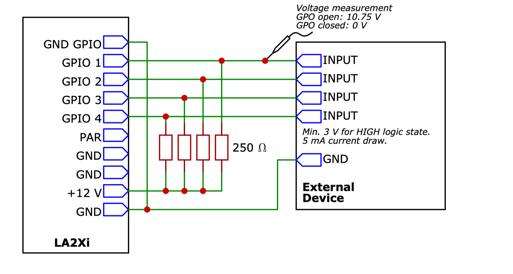

# GPIO

General-purpose input/output

在Digico和L-Acoustic设备上使用的简单探讨

## Digico GPI/O-Relays

TRS接口或DB37接口

继电器开关, GPI可以受控触发Macro等功能, GPO可以输出继电器指令给外部设备

## 功能面板介绍 

### GPIO Relays
GPO开关、 GPO模式、 macro模式和信号指示灯

- GPO action: 
  - toggle持续发送信号
  - pluse发送一个脉冲信号
- GPI macro mode: 
  - ON and OFF: 相当于延音踏板, 不踩就是关闭
  - ON Only: 想象成按钮开关, 点击切换ON/OFF
- GPI event : 有信号时亮起
- out: 打开或关闭对应GPO口, snapshot上有更详细的设置. 见下图

  - 

- In: 有输入信号时亮起

### GPIO和Macro

可以用GPI控制Macro的触发, 同时可以把GPO的开关做在Macro上

- 将Macro 分配到GPI即可用GPI触发: 

- 把GPO的开关做成Macro: 

### Digico GPI/O的应用例子

- GPI做成踏板给乐手控制调音台
- 邮轮、剧院等场地的防空警报响时, 给调音台GPI命令控制调音台全部静音
- GPO输出到播放器对讲机等, 实现在台子上控制外部设备

---

## L-Acoustic GPIO

支持此功能的设备: LS10、LA2Xi、P1 (以下说明会以LA2Xi为例)

GPIO接口数量:

| Product     |  GPI | GPO | GPIO |
| ---- |  ---- | ---- | ---- |
| LS10 | / | 1 | / |
| P1 | 1+1 | 2 | / |
| LA2Xi |  |      | 4 |

## L-Acoustic设备上GPIO主要功能

受外部逻辑电压控制, 触发特定的功能(如输出all mute/unmute). 以及根据设备状态向外发送继电器指令

* GPI: 接收外部逻辑电压, 实现对应的功能. 并未开放编程功能, 可以实现的功能见下表

  * | Function name               | Description                                           | Options                      |
    | --------------------------- | ----------------------------------------------------- | ---------------------------- |
    | None                        | The GPI is not used                                   | n/a                          |
    | Mute                        | Set all the outputs of the LA2Xi to mute.             | n/a                          |
    | Unmute                      | Set all the outputs of the LA2Xi to unmute.           | n/a                          |
    | Toggle Mute                 | Toggle between mute and unmute for all LA2Xi outputs. | n/a                          |
    | Standby                     | Set the LA2Xi to Standby mode.                        | n/a                          |
    | Wakeup                      | Set the LA2Xi to Online mode.                         | n/a                          |
    | Toggle Standby / Wakeup     | Toggle between Standby and Online modes.              | n/a                          |
    | Gain Up                     | Increase the gain of all outputs by +3 dB.            | n/a                          |
    | Gain Down                   | Decrease the gain of all outputs by −3 dB.            | n/a                          |
    | Load Conguration A*        | Load the conguration in selected memory slot A.      | Conguration slot A (1 to 8) |
    | Load Conguration B*        | Load the conguration in selected memory slot B.      | Conguration slot B (1 to 8) |
    | Load Next Conguration*     | Load the next available conguration.                 | n/a                          |
    | Load Previous Conguration* | Load the previously available conguration.           | n/a                          |

* GPO: 根据设备状态信息向外输出继电器命令, 可以监测的功能见下表: 

  * | Function name  | Description                                                  | Options                                                      |
    | -------------- | ------------------------------------------------------------ | ------------------------------------------------------------ |
    | None           | The GPO is not used.                                         | n/a                                                          |
    | State          | Manually set the GPO state.                                  | State Select                                                 |
    | Fault          | Report a selection of possible faults.                       | • Amplier state  • Output temperature  • Output error  • Ethernet Links  • AES/EBU Lock  • AVB Lock |
    | Alive          | Periodically switch between OPEN and CLOSED states.          | Alive Period (1 to 60 seconds)                               |
    | Ethernet Links | Report a failing or disconnected Ethernet network port.      | • Ethernet Port 1  • Ethernet Port 2                         |
    | PA/VA          | Report a PA/VA fault (input signal monitoring, loudspeaker load monitoring). | n/a                                                          |
    | AES/EBU Lock   | Report an AES/EBU lock issue on one or both AES/EBU inputs.  | • AES/EBU input 1-2  • AES/EBU input 3-4                     |
    | AVB Lock       | Report an AVB lock issue on the AVB input streams.           | • AVB input stream 1                                         |

## 设置工具

三种设备均可在LA Network Manager里进行GPIO设置, 也支持Q-SYS

## 举个🌰

参考gpio_tb_2.0

### 外部设备通过GPI进行控制

对于LA2Xi, 低电压为0 -1 V, 高电压为2 - 24V

请参考上下图片, 开关闭合时, 监测到高电压(high voltage), 执行一个功能(low->high), 开关打开时为低电压(low voltage), 执行另一个设置的功能(high->low)

### GPO控制外部设备

**设备状态**控制继电器开关的闭合/打开->实现输出给外部设备的电压值变化

---

## 参考来源

> [LA GPIO Technical Bulletin](https://www.l-acoustics.com/documentation/GLOBAL/EN/GPIO%20Technical%20Bulletin/GPIO_TB_EN.pdf)
>
> [LA2Xi - Owner's Manual](https://www.l-acoustics.com/documentation/ELECTRONICS/LA2Xi/EN/Owner's Manual/LA2Xi_OM_EN.pdf)
>
> [SD & Quantum Software Reference Manual](https://digico.biz/wp-content/uploads/2022/03/SD-Quantum-Software-Reference-Issue-E-V1528.pdf)
>
> [B112-SD-GPIO-Pin-Out](https://digico.biz/wp-content/uploads/2020/02/TB112-SD-GPIO-Pin-Out.pdf)
>
> [What do you guys use GPIO for? : livesound (reddit.com)](https://www.reddit.com/r/livesound/comments/kwihpu/what_do_you_guys_use_gpio_for/)

